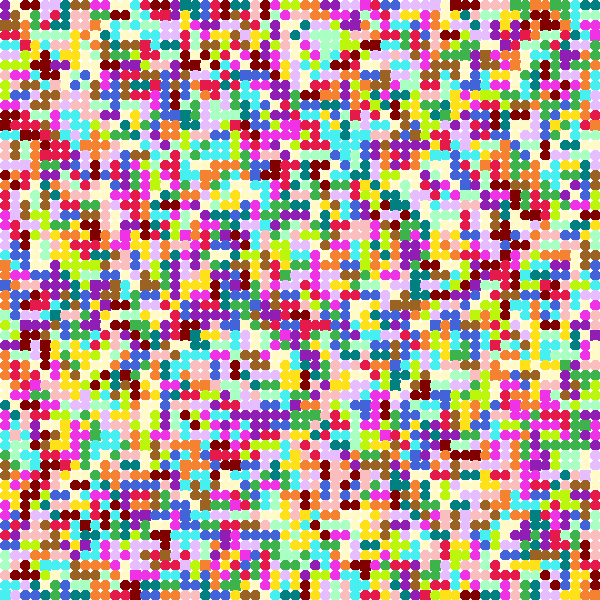
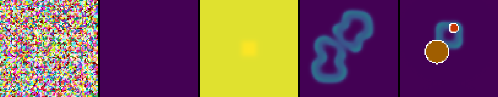
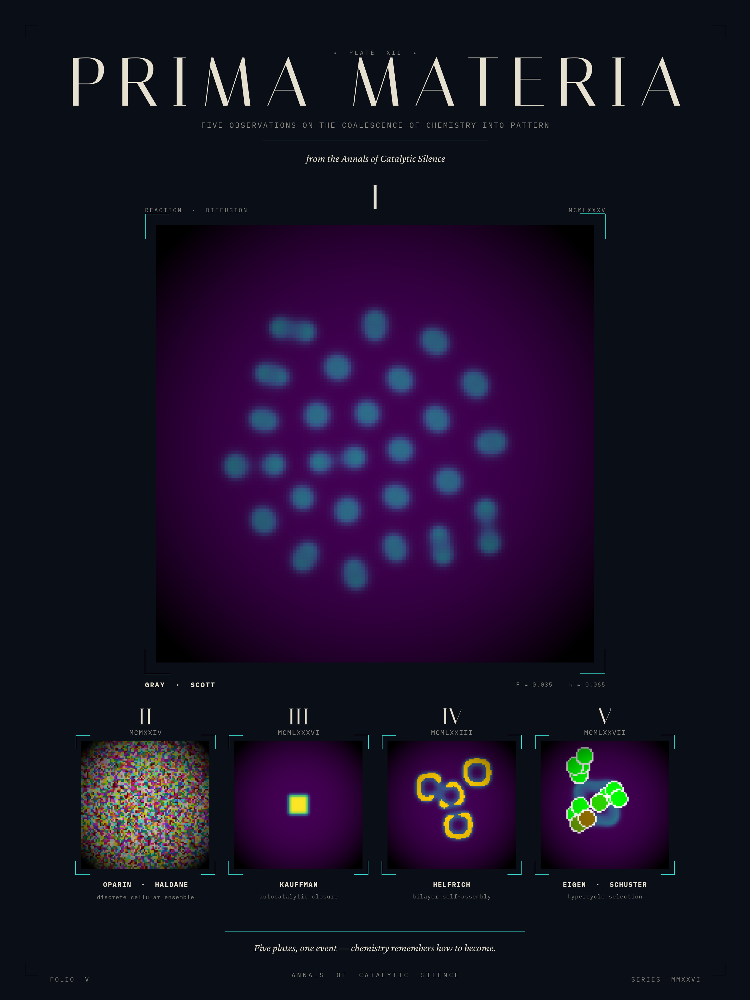
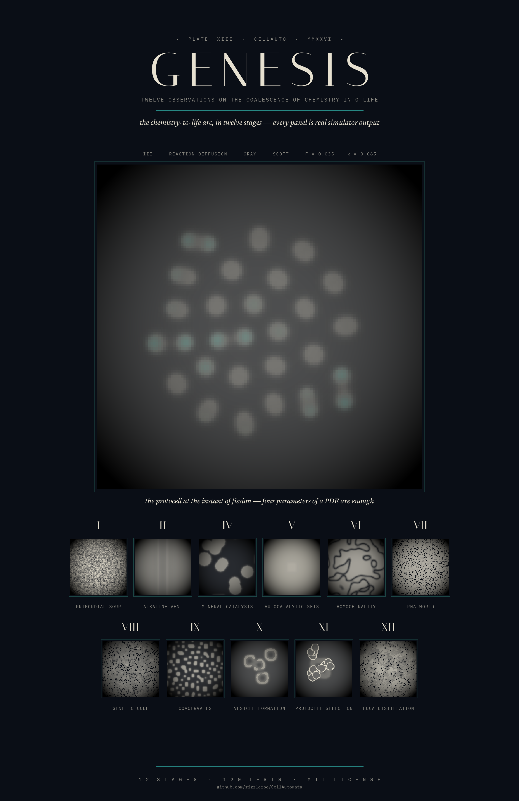

<p align="center">
  
</p>

# cellauto

[](https://github.com/rizzleroc/CellAutomata/actions/workflows/ci.yml)
[](LICENSE)


A scientifically-grounded cellular sandbox exploring the **chemistry-to-life
transition** — the abiogenesis problem — across a canonical five-stage
pipeline *and* a **12-stage extended pipeline** that walks every major
origin-of-life process (alkaline hydrothermal vents with real Wood-Ljungdahl
chemistry, mineral catalysis, autocatalytic sets, homochirality, RNA world,
genetic-code coevolution, coacervates, vesicles, protocell selection, and
LUCA distillation) in scientific order. Plus the two canonical reference
cellular automata (Conway, Wolfram 1D) for comparison.



*The project's hero result: Stage 1 Gray-Scott reaction-diffusion produces
self-replicating, dividing "protocell" spots. Pearson (1993) "spots" preset
(F=0.035, k=0.065). A four-parameter PDE is enough to manufacture emergent
cellular division — the central mystery of the chemistry-to-life transition,
visualised.*



*The five stages of the `abiogenesis-pipeline` rule, left → right: primordial
soup, Gray-Scott reaction-diffusion, Kauffman autocatalytic sets, lipid
vesicles, protocell selection. The pipeline rule walks all five end-to-end;
each can also be run in isolation. See [docs/science.md](docs/science.md) for
the math and citations.*



*Prima Materia (Plate XII, Series MMXXVI) — a museum-style scientific
plate composed from real cellauto simulations. The hero specimen is Stage 1
(Gray-Scott) caught at step 600; the four supporting specimens are Stages
0, 2, 3, 4 each captured at the moment its characteristic pattern emerges.
Design philosophy: [Catalytic Silence](docs/design/catalytic-silence.md).
Render script: [render_prima_materia.py](docs/design/render_prima_materia.py).*



*Genesis (Plate XIII, Series MMXXVI) — the v3.4 magnum opus. A single
museum poster compressing the full 12-stage extended pipeline into one
composition: the Stage 1 fission moment dominates as the hero, with the
other 11 stages arrayed as supporting medallions (primordial soup → vent
→ minerals → autocatalytic sets → homochirality → RNA world → genetic
code → coacervates → vesicles → protocell selection → LUCA). Every
panel is real simulator output. Render script:
[render_aaa_visuals.py](tools/render_aaa_visuals.py). Accompanied by the
12-panel
[Twelve Tableaux plate](docs/generated/cellauto_twelve_tableaux.png)
generated via the whipgen MCP, and per-stage Catalytic Silence plates for
the [genetic code](docs/generated/stage7_genetic_code_plate.png) and
[LUCA distillation](docs/generated/stage11_luca_plate.png) stages.*

## What this project actually is

The original v1.0 README called this a "natural-selection simulator." It
isn't. Read carefully, the four rules sketched in v1.0 describe the
prebiotic-chemistry chapter of the origin-of-life story: random mixing,
condensation, activated intermediates, compartmentalization. v3.0 honors
that intuition by implementing each stage with real (or toy-but-real-
concept) scientific machinery and citing the canonical literature.

See [docs/science.md](docs/science.md) for the full citation list and the
math behind each stage. The short version:

| Stage | Concept | Science |
|---|---|---|
| 0 — primordial soup | Molecules mixing/condensing; initial mix weighted by **Miller's 1953 measured yields** | Oparin (1924), Haldane (1929), Miller-Urey (1953) |
| 1 — reaction-diffusion | Gray-Scott PDE producing self-replicating spots | Turing (1952), Gray-Scott (1985), Pearson (1993) |
| 2 — autocatalytic sets | Kauffman RAFs via the **correct Hordijk-Steel layered closure** (catalysis mandatory) | Kauffman (1986), Hordijk & Steel (2004) |
| 3 — vesicle formation | Lipid self-assembly above the **measured CMC** of a named fatty acid | Helfrich (1973), Deamer, Hanczyc & Szostak (2003) |
| 4 — protocell selection | Hypercycle-flavoured fitness; **Eigen error threshold ≈ 1/L** | Eigen & Schuster (1977), Szostak |

Every constant traces to a published measurement; see
[docs/science.md](docs/science.md) for the values and citations. The
`abiogenesis-pipeline` rule walks all five stages end to end.

Seven more origin-of-life processes ship as standalone selectable rules
and together appear as the **12-stage `abiogenesis-pipeline-extended`** in
scientific order — soup → vent → RD → mineral → RAF → chirality → RNA →
genetic code → coacervate → vesicles → selection → LUCA:

| Process | Science |
|---|---|
| **Alkaline hydrothermal vent** | Proton gradient does the thermodynamic work; PMF (mV) and ΔG (kJ/mol) read out live from the Nernst equation. Wood-Ljungdahl carbon fixation models the actual chemistry (2 CO₂ + 4 H₂ → acetate, ΔG° = −95 kJ/mol). (Russell & Hall 1997; Lane & Martin 2012) |
| **Mineral-surface catalysis** | Polymerisation of activated ImpA monomers localised to Na-montmorillonite (Ferris 1996; Cairns-Smith 1982) |
| **Homochirality** | Frank-model autocatalysis + mutual antagonism (Frank 1953; Soai 1995) |
| **RNA world** | Spatial Eigen quasispecies; error catastrophe at `ε_c = ln(σ)/L` (Gilbert 1986; Eigen 1971) |
| **Genetic-code coevolution** | Code → translation product → selection feedback drives convergence (Vetsigian-Woese-Goldenfeld 2006; Ikehara GADV-protein world) |
| **Coacervates** | Cahn-Hilliard liquid-liquid phase separation (Oparin 1924; Banani et al. 2017) |
| **LUCA distillation** | Comparative-genomics parsimony with a 70 % prevalence threshold; surfaces the conserved gene families shared by every surviving lineage (Weiss et al. 2016) |

## Try it in your browser (no install)

A live in-browser Stage 1 demo lives at [`docs/web/`](docs/web/) — a single
static page with the Gray-Scott reaction-diffusion PDE running on a `<canvas>`
via vanilla JS (no Pyodide). F/k sliders, Pearson preset chips, and the same
viridis colormap as the desktop build. The other stages are exhibited as
static museum plates beneath. Deployable to GitHub Pages from `/docs`.

## Run the full sandbox in a browser locally (`cellauto web`)

**Live demo:** <https://cellautomata-production.up.railway.app/> — full
17-rule sandbox running on Railway (one-worker container; expect a few
seconds of cold-start on first hit).

For the entire 17-rule catalog — every abiogenesis stage, Conway, Wolfram —
in a browser locally, ship the desktop engine behind a tiny Flask server:

```bash
pip install -e ".[web]"
cellauto web                 # → http://127.0.0.1:8765
cellauto web --host 0.0.0.0  # expose on the LAN
```

It's the same Python engine the GUI uses; the browser is just a thin
control surface (rule picker, grid size, seed, play/pause/step, speed
slider, per-rule tutorial). Frames are rendered server-side via each
rule's existing `render_rgb` and streamed as PNGs.

### Deploy `cellauto web` to Railway

The repo ships a `Dockerfile` + `railway.toml` so Railway can host the
full sandbox at a public URL:

1. **New Project → Deploy from GitHub repo** → pick `CellAutomata`.
2. Railway detects the `Dockerfile` and builds it. No env vars needed
   — `$PORT` is injected by Railway and respected by the container.
3. Under **Settings → Networking**, click **Generate Domain** to get
   a public `*.up.railway.app` URL.
4. Healthcheck is wired to `GET /api/health` (returns `{status: "ok"}`).

Production runs `gunicorn cellauto.web.wsgi:app` with one worker + four
threads (sessions live in-process — see `cellauto/web/wsgi.py`).

## Install

```bash
pip install -e .
# or, for development:
pip install -e ".[dev]"
```

Python 3.10+ required. Stdlib `tkinter` for the GUI; `numpy` for the
continuous-field stages; `Pillow` for GIF export.

## Quick start

```bash
# Launch the GUI with the full abiogenesis pipeline.
cellauto gui

# Or the browser sandbox (needs `pip install -e ".[web]"`).
cellauto web

# Pick a specific stage to study in isolation.
cellauto gui --rule abiogenesis-stage1-grayscott --grid 100

# Headless: run 200 steps of stage 2 with a fixed seed.
cellauto simulate --rule abiogenesis-stage2-raf --grid 80 --steps 200 --seed 7

# Render an animated GIF — Pearson's "mitosis" preset, 60 frames.
cellauto export --rule abiogenesis-stage1-grayscott \
    --rule-config preset=mitosis --grid 100 --steps 60 --out exports/mitosis.gif

# Wolfram rule 110 (Turing-complete) — pick a specific rule number.
cellauto simulate --rule wolfram1d --rule-config rule_number=110 --grid 80 --steps 50

# Resume a run from a snapshot.
cellauto gui --load snapshots/my-run.json
```

## Performance

The honest perf story for the v3.0 renderer:

| Renderer | Used by | 80×80 / 30 frames | 200×200 / 30 frames |
|---|---|---|---|
| FieldRenderer (numpy → PhotoImage blit) | Stages 1–4 | 0.39 s | 0.08 s |
| DiscreteRenderer (canvas items) | Stage 0, Conway, Wolfram | 0.60 s | (slow, not recommended) |
| v1 `canvas.delete("all")` (baseline) | (was used by v2.0) | 2.87 s | dies |

So: **~7× speedup for the continuous-field stages**, which are the new ones.
The discrete-cell renderer is comparable to v1 — Tk Canvas items are
inherently slow per item; the fix in v3.0 was correcting v2.0's claim and
removing a buggy per-cell `canvas.type()` roundtrip that made it *slower*
than v1 in practice.

## Rule registry

| Rule name | Renderer | What it is |
|---|---|---|
| `abiogenesis-pipeline` | mixed | Canonical 5-stage pipeline, auto-promoting |
| `abiogenesis-pipeline-extended` | mixed | **12-stage pipeline** walking *every* shipped origin-of-life process in scientific order |
| `abiogenesis-stage0-soup` | discrete | Primordial soup; init weighted by Miller's 1953 yields |
| `abiogenesis-stage1-grayscott` | field | Gray-Scott reaction-diffusion |
| `abiogenesis-stage2-raf` | field | Kauffman RAF autocatalytic chemistry |
| `abiogenesis-stage3-vesicles` | field | Lipid bilayer self-assembly (CMC threshold of a named fatty acid) |
| `abiogenesis-stage4-selection` | field | Protocell selection / hypercycle proxy |
| `abiogenesis-rna-world` | field | Spatial Eigen quasispecies — error catastrophe live (Gilbert 1986) |
| `abiogenesis-homochirality` | field | Frank (1953) chiral symmetry breaking — teal/magenta domains |
| `abiogenesis-hydrothermal-vent` | field | Lane-Martin chemiosmosis — pH gradient + Wood-Ljungdahl CO₂ fixation with live PMF/ΔG readouts |
| `abiogenesis-coacervate` | field | Cahn-Hilliard membraneless droplets (Oparin) — coarsens over time |
| `abiogenesis-mineral-catalysis` | field | Na-montmorillonite clay mask — Ferris-style surface catalysis of activated ImpA monomers |
| `abiogenesis-genetic-code` | field | Vetsigian-Woese-Goldenfeld code coevolution — codon→amino-acid table converges under selection |
| `abiogenesis-luca` | field | LUCA distillation — comparative-genomics parsimony surfaces the core gene set (Weiss et al. 2016) |
| `conway` | discrete | Conway's Game of Life (B3/S23) |
| `wolfram1d` | discrete | Elementary 1D automaton, rule 0–255 |
| `natural-selection` | discrete | **Legacy alias** — same mechanics as Stage 0 |

## GUI controls

The window is a fixed-width "museum plate"; its content **scrolls vertically**
so every control is reachable on any screen size.

**Configuration**
- **Rule / Grid** dropdowns; **Reseed** (fresh seed) and **Restart** (rewind
  to step 0 keeping the current parameter sliders) buttons.
- **Promote** advances the pipeline one stage; pipeline rules also expose a
  **JUMP** combobox (direct stage navigation, 0..N-1, sized to the active
  pipeline), an **AUTO-PROMOTE** checkbox, and a **DUR** spinbox for the
  stage-duration in steps.

**Parameters (scientific knobs)**
- A dynamic **PARAMETERS** panel exposes every live scientific knob for the
  active rule — F/k/Du/Dv for Gray-Scott (with a Pearson regime preset
  picker), error rate ε / superiority σ for the RNA world, antagonism kₓ
  for the chirality model, vent / ocean pH for the hydrothermal vent, line
  tension κ for coacervates, k_clay vs k_bulk for mineral catalysis, mutation
  rate / radius / decay age for protocell selection, etc.
- A **RESET** button restores the rule's dataclass defaults. Structural
  parameters (n_species/n_reactions/food_fraction for Stage 2, rule_number
  for Wolfram1D) auto-reinit deterministically from the engine seed.

**Transport**
- **Step / Play / Stop**; FPS slider; **Tutorial** (per-rule, with citations).
- **SCRUB** Scale rewinds through the bounded ring buffer of serialized
  state — stepping after a scrub-back truncates the future so timelines
  branch rather than overwrite.
- **Record GIF** with progress dialog + cancel.

**Observation overlays**
- **Live stage caption + colour legend** drawn on the canvas; entering a new
  stage announces its principle and citations in the marginalia and pops a
  brief **chapter card** overlay.
- **Visual colorbar** under the canvas (viridis, red→green for Stage 4 fitness,
  or the relevant diverging map for chirality/vents/coacervates/minerals).
- **Sparkline** trace of the headline population stat (rolling 180 samples).
- Click any **Stage 4** protocell disc to open the per-protocell inspector
  (position, radius, age, fitness, genome vector).

**Menus**
- **File** — Open/Save snapshot (JSON, exact RNG round-trip); Export frame
  as PNG; Export stats as CSV; Export GIF.
- **Gallery** — six per-stage Catalytic Silence plates, a full-arc pipeline
  poster, the three v3.1 plates, and a live **Reaction network (Stage 2 RAF)**
  view rendered programmatically from the current network.
- **View** — text size (Small / Default / Large / Extra-large) and a
  Colour-blind safe palette toggle (Wong blue→yellow for Stage 4 fitness).
- **Help** — Tutorial, Keyboard shortcuts, About.

**Keyboard shortcuts**
| Key | Action |
|---|---|
| Space | Play / Pause |
| → (Right) | Single step (when paused) |
| R | Restart to step 0 |
| P | Promote stage (forward) |
| `[` / `]` | Pipeline stage: previous / next |
| Ctrl+N | New run (reseed) |
| Ctrl+O / Ctrl+S | Open / Save snapshot |
| Ctrl+Q | Quit |

Shortcuts are suppressed while a Spinbox or Combobox has focus, so editing
slider values never triggers a transport action.

See [docs/ROADMAP.md](docs/ROADMAP.md) for the full feature inventory,
punchlist, and mandated UI toolset contract.

## Reproducibility

Every run is deterministic from its seed *including* across save/load.
v2.0 had a bug where `Engine.load` reset the RNG; v3.0 serializes the RNG
state alongside the cell state so a snapshot + continuation matches a
continuous run bit-for-bit.

## History

The project's history is its own gap analysis:

- **v1.0** (2024): "natural-selection simulator" that didn't implement
  any of its four rules correctly. See the original
  [PRD.md](PRD.md) for the brutal gap analysis.
- **v2.0** (2026-05-18): a working sandbox with pluggable rules, headless
  CLI, GIF export, tests, CI. Three of the headline claims didn't survive
  a careful read; see [PHASE2_BRUTAL.md](../PHASE2_BRUTAL.md) (the self-audit).
- **v3.0** (2026-05-19): the science-based rebuild. Reframed as
  abiogenesis (the project's true premise). Stage 0 fixes the Rule 3 bug
  v2.0 left as a no-op. Stages 1–4 add real reaction-diffusion (Turing /
  Gray-Scott), Kauffman RAFs, lipid self-assembly, and hypercycle-based
  protocell selection with citations to the original literature.
- **v3.1** (2026-05-19): AAA polish pass. GIF export threaded with a
  progress bar and Cancel button. Stage 4 fitness replaced with the
  Eigen-Schuster hypercycle coupling (PHASE2_BRUTAL §29 closed). CI adds
  Windows job, mypy, ruff format, 80% coverage threshold, pip-audit, and
  concurrency cancellation.
- **v3.2** (2026-05-22): scientific-rigor + AAA overhaul. Fixed a genuine
  bug — the RAF detector was not the Hordijk-Steel algorithm and reported
  false-positive autocatalytic sets; rewrote it to the correct layered
  food-generated closure with mandatory catalysis. Replaced toy constants
  with published data (Miller-Urey yields, fatty-acid CMCs, Eigen error
  threshold). **Added six new origin-of-life processes** as selectable
  rules: RNA world, homochirality, alkaline hydrothermal vent, coacervates,
  mineral-surface catalysis (plus the original 5-stage pipeline).
  Surfaced the science in the UI (live stage captions, transition
  citations, colorbar, RAF network graph view, sparkline). Generated six
  museum-quality stage plates via the whipgen MCP. Full mandated UI
  toolset: live parameter sliders incl. structural, JUMP/AUTO-PROMOTE/DUR,
  RESET/RESTART, PNG/CSV export.
- **v3.3** (2026-05-22): completing the genesis-of-life mandate. Added the
  **`abiogenesis-pipeline-extended`** rule — a 10-stage auto-promoting
  pipeline that walks every shipped process end-to-end in scientific order
  (soup → vent → RD → mineral → RAF → chirality → RNA → coacervate →
  vesicles → selection). Story-mode chapter transition cards. Per-protocell
  inspector (click any Stage 4 disc → genome / fitness / age popup).
  Timeline scrubber with branching truncation. Accessibility pass:
  text-scaling, Wong CVD-safe palette for Stage 4, full keyboard
  navigation (Space/→/R/P/[/]) with text-entry focus guards and a
  Keyboard shortcuts dialog.
- **v3.4** (2026-05-23): closing the honest science gaps. Added two new
  stages — **genetic-code coevolution** (Vetsigian-Woese-Goldenfeld; codon →
  amino-acid table converges under selection) and **LUCA distillation**
  (Weiss et al. 2016 comparative-genomics parsimony with a 70 % prevalence
  threshold), extending the pipeline to **12 stages**. Replaced the toy
  vent gradient with **real thermodynamics**: live PMF (mV) from the Nernst
  equation and ΔG (kJ/mol) via the Faraday constant, plus
  **Wood-Ljungdahl carbon fixation** (2 CO₂ + 4 H₂ → acetate, ΔG° =
  −95 kJ/mol). Tagged molecules with their real chemistry names (Ferris
  ImpA, Na-montmorillonite, Ikehara GADV amino acids, sixteen LUCA gene
  families). Static-HTML **web port** of Stage 1 deployable to GitHub Pages.
  AAA release poster generated via the whipgen MCP. Fixed two bugs
  reported in the field: chapter-card overlays now dismiss reliably, and
  the default sim speed is slower so transitions are observable. CI gates
  all green (ruff, ruff-format, mypy, pytest with 87 % coverage).

**120 tests, all passing.** See [docs/science.md](docs/science.md) for the
math and citations, and [docs/ROADMAP.md](docs/ROADMAP.md) for the feature
inventory, mandated UI toolset, and remaining roadmap. Full version history in
[CHANGELOG.md](CHANGELOG.md).

## License

MIT — see [LICENSE](LICENSE).
