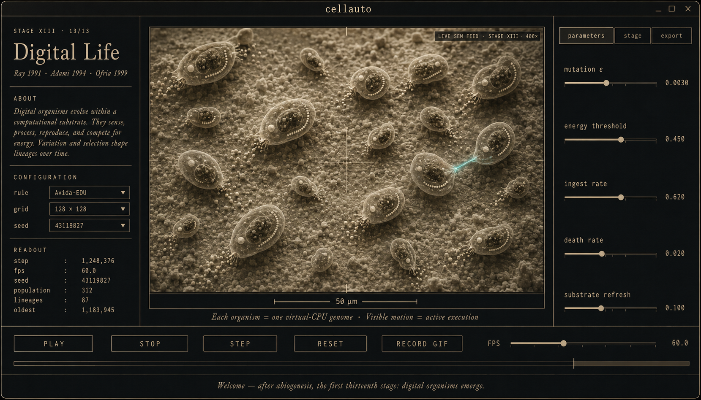

# PRD — LIFE: Digital Organisms (v5.0)

**Status:** Draft · proposed for v5.0 cycle
**Last updated:** 2026-06-01

*v5 UI mockup, generated via the whipgen MCP (ChatGPT image, 1792×1024) on
2026-06-01. Three-column desktop layout: left "wall label" with stage title,
citations, ABOUT paragraph, CONFIGURATION + READOUT; centre canvas as a live
400× SEM feed of digital organisms with translucent body walls, visible gut
compartments, genome instruction tapes, ingestion/excretion particles, and
one teal-glowing protocell caught mid-division (the only chromatic accent in
the composition); right column with parameters / stage / export tabs and
sliders for mutation ε / energy threshold / ingest rate / death rate /
substrate refresh; bottom bar with PLAY/STOP/STEP/RESET/RECORD GIF + FPS
slider + scrub track + marginalia ticker. This is the v5.1 target — V10
internal anatomy + V8 inspector + the Brachionus-style microscopy look — not
the v5.0.0 first ship (which renders organisms as filled energy-coloured
discs under v3.6 viridis until the v4.0 SEM cycle lands).*

---

## 0. Where we are (state review)

Two parallel work tracks are active, both green. This PRD is the
post-abiogenesis follow-on for **both**.

### Track A — Python desktop (`cellauto/`)
- **v3.6 SHIPPED.** Twelve coupled origin-of-life stages running real
  dynamics; Tk + web parity on UX qualities. 141 tests, 88 % coverage,
  four CI gates green.
- **v4.0 PRD merged, code unstarted.** SEM-grade depth-shaded
  rendering. Twelve items S1–S12 open in `ROADMAP.md` §6.

### Track B — Web client (canonical: `docs/web3/`)
Three bundles exist in `docs/`; the redirect chain says which is canonical:

- **`docs/web3/`** — **CANONICAL CURRENT**. Implements the v4.0 SEM PRD
  **plus** v4.1's §F3 bioform sprite-overlay layer (procedural canvas
  painters for protocell spheres, amoebas, granules, L/D chirality
  glyphs, coacervate droplets, mineral honeycombs, lipid bilayers).
  Sprite mode opt-in via `x` hotkey or sidebar checkbox (defaults OFF
  after the v4.1.1 calm-overlay revision found the launch defaults
  too dominant). Lives on branch `origin/claude/zealous-meitner-SrX1L`;
  not yet merged to `main`. Root `docs/index.html` redirects `/` →
  `/web3/`. Web3 has the FIRST of the five Python-only stages
  shipped — **B3 vesicles** (Helfrich-curvature bilayer,
  `∂φ/∂t = D∇²φ − γφ(1−φ)(½−φ) − κ(∇²)²φ + noise`).
- **`docs/web2/`** — production-deployed multi-rule sandbox, preserved
  for history at `/web2/`. Nine rules, no sprite layer, no vesicles.
  Shipped The Control Round (preset-regime rows for the continuous
  rules) on 2026-05-30. Slightly ahead of web3 on preset surface,
  behind on rendering + vesicles.
- **`docs/web/`** — original Gray-Scott-only museum plate (v3.x), kept
  at `/web/` for the historical record.

The authoritative open-gap punchlist is `docs/web3/PUNCHLIST.md`.

### Open punchlist on web3 (the canonical client)

- **B1** RAF — Kauffman autocatalytic sets, graph-on-canvas.
- **B2** RNA world — Eigen quasispecies, error-catastrophe knob.
- **B3** ~~vesicles~~ — **CLOSED 2026-05-31** via web3 v4.1 (Helfrich
  bilayer with biharmonic curvature term).
- **B4** Genetic code — Vetsigian-Woese-Goldenfeld 4×4 codon table.
- **B5** LUCA — pathway-graph parsimony.
- **A4** "About this stage" persistent panel — 50-word origin-of-life
  paragraph per rule.
- **C2** Horizontal chapter rail above the canvas.
- **D2** Preset row for non-Gray-Scott continuous rules (web2 closed
  this via The Control Round; web3 forked before that and still has
  it open — likely portable from web2).
- **D3** Regime-threshold badges (Pearson F=k boundary, Frank ee
  critical, Eigen catastrophe).
- **F1** Marginalia → vertical side-card.
- **F2** localStorage persistence of rule + palette + SEM mode.
- **F3** Reduced-motion mode documented in the page UI.

### Combined open punchlist by priority

| Bucket | Items | Where it lives |
|---|---|---|
| **P0 — none** | All P0 closed | — |
| **P1 — web rule parity to Python** | B1 (RAF) · B2 (RNA world) · B4 (genetic code) · B5 (LUCA) — *B3 vesicles closed in web3 v4.1* | `docs/web3/PUNCHLIST.md` §3-B |
| **P1 — web explanation layer** | A4 (about-stage panel), D2 (preset row port from web2) | `docs/web3/PUNCHLIST.md` |
| **P1 — desktop SEM cycle** | S1 (renderer core) · S2 (palettes) · S3 (toggle) · S4 (framing) · S5 (Stage 1 hero) | `docs/ROADMAP.md` §6 |
| **P2 — web UX polish** | C2 (chapter rail) · D3 (threshold badges) · F1–F3 | `docs/web3/PUNCHLIST.md` |
| **P2 — desktop SEM polish** | S6–S12 (sprite library → AI refinement) | `docs/ROADMAP.md` §6 |
| **P2 — desktop L items deferred** | L2 (tab refactor) · L10 (grain texture) | `docs/ROADMAP.md` §5 |

Nothing P0-blocking. The cycle direction question is now:
**B1/B2/B4/B5 web rule parity** vs **S1–S5 desktop SEM** vs **the new
LIFE module this PRD scopes**. The remainder of this document scopes
LIFE so the choice can be made explicitly.

---

## 1. Vision

> *"After LUCA distillation, there's life — actual living digital
> organisms with visible internal motion, metabolism, ingestion,
> reproduction, and selection."*

The reference is the user-supplied image of *Brachionus plicatilis* at
400× DIC microscopy — a real living rotifer with **its stomach
contents visibly in motion**. That motion is what reads as "alive":
visible internal anatomy, visible peristalsis, visible ingestion of
particles, visible reproduction of next-generation organisms inside the
mother. This is what an instrument view of life — not chemistry —
looks like.

The v3.x simulator stops at Stage XII (LUCA distillation): the *recipe*
for life. The v4.0 SEM cycle is about *how* every stage is rendered.
The v5.0 LIFE cycle extends the *content* itself: post-LUCA, the model
walks into the lineage that emerged. Discrete digital organisms with:

1. **A bounded body** (membrane, visible as the cell wall in the
   reference image).
2. **Visible internal anatomy** — a "gut" compartment with ingested
   particles, "mitochondria" proxies (energy metabolism), and the
   genome itself rendered as readable instructions.
3. **A metabolism loop** — ingest substrate from the environment,
   convert to energy, excrete waste, die without energy.
4. **A virtual-CPU genome** that **executes** — instructions step
   like real biology, not just a probability table.
5. **Reproduction** — organisms split when energy is sufficient; the
   genome is copied with point mutation.
6. **An ecology** — competition for shared substrate, parasitism
   between lineages, occasional symbioses.

The aesthetic target is the Brachionus screenshot: a single organism
visibly twitching, with light passing through a translucent body wall
and the gut contents drifting under DIC contrast.

---

## 2. Scientific basis — real artificial-life research

This is not invention. The LIFE module draws from a well-established
line of research:

| System | Year | What it contributed | What we adopt |
|---|---|---|---|
| **von Neumann self-replicator** | 1948 | Self-reproducing automaton theory; the universal constructor | The "tape that builds itself" architectural pattern |
| **Tom Ray's Tierra** | 1991 | Self-replicating assembly-language programs in a shared "soup" of CPU time, with selection on replication speed and parasites that hijacked host code | The shared-memory variant (Phase 2); the parasite ecology |
| **Avida (Ofria et al.)** | 1999– | Grid-based digital organisms, each with its own virtual CPU; energy-bonus for complex computations; the canonical empirical AL platform | The grid-cellular variant (Phase 1); the metabolism mechanic |
| **Polyworld (Yaeger)** | 1994 | Neural-net-controlled agents in a 2-D world; vision, fight, mate, eat | The body-with-sensors framing (Phase 3) |
| **Framsticks (Komosinski)** | 1996– | Physical bodies with simulated mechanics + neural controllers | Body-shape evolution (out of scope for v5.0) |
| **Hashlife / Conway's Life** | 1970 | Self-replicators provably exist in simple CA | The discrete-cellular substrate baseline |
| **Geb (Channon)** | 2003 | Unbounded evolutionary innovation in a digital substrate | The "infinitely-replenished substrate" environmental rule |

References for `docs/science.md` integration:

- Ray, T. S. (1991). *An approach to the synthesis of life.*
  Artificial Life II, Santa Fe Institute, 371–408.
- Adami, C., & Brown, C. T. (1994). *Evolutionary learning in the 2D
  artificial life system 'Avida'.* Artificial Life IV, 377–381.
- Ofria, C., & Wilke, C. O. (2004). *Avida: a software platform for
  research in computational evolutionary biology.* Artificial Life,
  10(2), 191–229.
- Yaeger, L. S. (1994). *Computational genetics, physiology, metabolism,
  neural systems, learning, vision, and behavior or PolyWorld:* Life in
  a new context. Artificial Life III.
- Channon, A. D. (2003). *Improving and still passing the ALife test:*
  Component-normalised activity statistics classify evolution in Geb as
  unbounded. Artificial Life VIII.

---

## 3. Goals & non-goals

### In scope (v5.0)
1. A new **stage XIII — LIFE** in the canonical pipeline, picking up
   from XII LUCA. The simulator now has 13 stages.
2. Each digital organism has a **virtual-CPU genome** that executes
   instruction-by-instruction. The genome IS the organism's behaviour;
   no separate fitness vector.
3. **Visible internal anatomy** matching the Brachionus reference — a
   transparent body wall with internal compartments and visible
   substrate ingestion / motion.
4. **Metabolism**: organisms ingest substrate from the environment,
   convert it to energy, excrete waste, and die when energy = 0.
5. **Reproduction**: when energy crosses a division threshold, the
   organism splits; the genome is copied with per-instruction mutation.
6. **Population dynamics** — competition for shared substrate; the
   long-run behaviour is open-ended evolution (Channon test on Geb).
7. **Compatibility**: ships in both desktop (Python) and web (web2)
   clients. The web is allowed a smaller default population.
8. **Scientific honesty**: every behaviour in the rendered organism
   maps to a real instruction or state in the virtual machine. No
   decorative motion.

### Non-goals (deliberately deferred)
- **Multicellular organisms** with differentiated tissues.
  Single-celled organisms only in v5.0.
- **Neural-network controllers** à la Polyworld — the genome stays an
  instruction tape (Tierra/Avida style), not a network.
- **3-D bodies / physical morphology** à la Framsticks.
- **Cross-species symbiosis as a first-class mechanic** — emergent
  parasitism is allowed (Tierra-style), but symbiosis is v5.1+.
- **Replacing the v4.0 SEM renderer.** LIFE feeds the same renderer the
  rest of the pipeline uses; it's content, not a new render path.

---

## 4. Functional requirements

### F1 — Virtual machine
A small virtual CPU with these properties:

  - **Instruction set**: ~20 opcodes — load, store, add, sub, jump,
    compare, copy, divide, ingest, excrete, sense, no-op. Tierra-derived.
  - **Memory model**: each organism has its own private memory
    (Avida-style) of ≤ 512 instructions. (Tierra's shared memory is
    Phase 2; the default architecture is private memory because it
    sidesteps the entire ecological-complexity question for v5.0.)
  - **Energy model**: every instruction executed costs 1 unit of
    "energy". Energy is replenished by `INGEST` opcodes that consume
    substrate from the environment grid cell.
  - **Mutation**: a per-instruction probability ε of one-bit flip at
    copy time (genome → daughter). ε is exposed as a slider; the
    Eigen error catastrophe at ε_c = ln(σ)/L still applies — at very
    high ε, lineages can't survive.

### F2 — Population dynamics
  - **Grid substrate**: a 2-D grid (default 60 × 60) of cells; each
    cell holds (a) substrate concentration S ∈ [0, 1], (b) up to one
    organism, (c) waste W.
  - **Substrate replenishment**: linear toward S → S_max at rate r_S.
    Default r_S = 0.05 / step.
  - **Waste accumulation**: organisms excrete; high W is toxic to
    nearby organisms (death probability increases linearly).
  - **Movement**: organisms execute SENSE + MOVE opcodes to relocate
    to neighbouring cells; movement costs energy.
  - **Reproduction**: at energy ≥ E_div the organism divides into the
    least-occupied Moore neighbour; daughter genome is copied with ε
    mutation; energy is split 50/50.
  - **Death**: when energy = 0, the organism dies; its body becomes
    substrate for neighbours (Tierra-style).

### F3 — Visible internal anatomy
This is the rendered-content side. For each organism the renderer
draws:

  - **Body wall** — a translucent hairline ellipse / amoeboid shape
    sized to the organism's energy level (bigger = more energy).
  - **Genome compartment** — a small region of dots showing the
    next 16 instructions; the currently-executing instruction is
    highlighted teal.
  - **Gut / ingestion** — substrate particles drifting from the
    environment into the organism's "mouth" point and dissolving
    in the gut region; matches the Brachionus reference.
  - **Cytoplasmic motion** — a low-amplitude noise overlay tied to
    the organism's current execution rate, so an active organism
    "shimmers" and a paused one is still. This is the "motion you
    can see" the rotifer image showed.
  - **Waste excretion** — when the organism fires `EXCRETE`, a tiny
    particle drifts out of its rear toward the cell's W field.

### F4 — Pipeline integration
  - LIFE is **stage XIII** of the extended pipeline. Promotion from
    XII LUCA seeds the initial population at the brightest cells of
    LUCA's pathway-graph signal (per the v3.5 G1 hand-off plumbing).
  - **`extract_signal` for downstream stages** returns the population
    density × per-organism fitness, suitable for hypothetical Stage
    XIV (multicellularity, v5.1).

### F5 — Rendering integration
  - Under v3.6 viridis mode: organism bodies as filled discs coloured
    by energy; substrate as the background field; waste as a darker
    overlay.
  - Under v4.0 SEM mode (when shipped): each organism rendered with
    the depth-shaded sprite-library approach from S6/S7. The Brachionus
    reference is the visual target.
  - **Click-to-inspect**: clicking an organism opens an inspector
    Toplevel (Tk) / drawer (web) showing the genome, energy,
    instruction pointer, ancestry tree (parent → grandparent → …).

### F6 — Web parity
  - LIFE ships in `docs/web3/rules/life.js` (the canonical web client)
    simultaneously with the Python desktop implementation. The web's
    smaller default population (200 organisms vs 600 desktop) keeps
    the JS-side interpreter performant.
  - Under web3, LIFE benefits from the v4.1 sprite-overlay layer for
    free — the body-wall, gut, and genome-strip sprites slot into the
    existing `sprites.js` painter library as new procedural painters.
    Internal anatomy (V10) and Brachionus-style rendering (the
    headline visual goal) requires sprite mode ON.
  - The web client cannot share Python's virtual-CPU code, so we
    write the interpreter twice — once in Python, once in JS. A
    `tests/test_life_vm_parity.py` pin asserts that the same genome
    on the same substrate runs identically on both interpreters for
    100 steps.

### F7 — Performance budget
  - Default 60 × 60 grid, 400 organisms, virtual CPU at 1 instruction
    per organism per step: **20 FPS on the same v4.0 target hardware**
    (2020 ThinkPad-class CPU).
  - High-pop mode (1000 organisms): **5 FPS** acceptable.

### F8 — Honest emergence guard
  - The simulation must be capable of producing **at least one
    distinct lineage** (parasites, hyper-replicators) within 10,000
    steps at default parameters, on the default seed. Pinned by
    `tests/test_life_lineages.py`. If this regresses, something has
    broken the dynamics.

---

## 5. Visual requirements (Brachionus alignment)

The user-supplied reference image (`docs/ideal_life_view.png`, to be
saved) shows the visual target:

  - **Translucent body wall** — single-layer hairline ellipse;
    interior visible through it. *Not* a filled disc.
  - **Internal compartments** — multiple distinct sub-regions
    visible inside the organism: gut (with ingested particles), genome
    (instruction strip), nucleus (replication site).
  - **Visible motion** — the gut contents drift; the cytoplasm
    shimmers at organism activity rate.
  - **DIC-style contrast** — the v4.0 warm-sepia palette applied
    with extra emphasis on the body-wall hairline and shadow under
    each organism.
  - **400× framing** — the "LIVE SEM FEED · Stage XIII · 400×" badge
    upper-right, matching the reference's "Brachionus / 400×" label.
  - **A scale bar** showing "50 μm" with a hairline marker, sized
    proportionally to the grid.

---

## 6. Phased roadmap

| Phase | Deliverable | Acceptance gate |
|---|---|---|
| **5.0.0 — Virtual CPU** | Stage XIII rule with VM + energy + reproduction + per-organism inspector. Renders as filled discs under v3.6 viridis path. | At least one lineage distinct from the founder within 10k steps. ε_c regression pinned. |
| **5.0.1 — Translucent body sprite** | Each organism rendered with a translucent-ellipse body sprite (no internal anatomy yet, just the membrane). | Side-by-side comparison: organisms read as cells, not discs. |
| **5.1 — Internal anatomy** | Gut + genome strip + nucleus compartments visible inside each organism. Cytoplasmic shimmer tied to instruction rate. | Brachionus-style preview shipped to `docs/generated/stage13_life.png`. |
| **5.2 — Ecology mechanics** | Predation between lineages; waste-toxicity gradient; cross-cell substrate gradient. | A self-organised "predator-prey" cycle visible in the population sparkline within 20k steps. |
| **5.3 — Web parity** | `docs/web2/rules/life.js` shipped; virtual-CPU parity test green; web smoke test extended. | Same genome runs identically on Python + JS for 100 steps. |
| **5.4 — Shared-memory variant (Tierra mode)** | Optional `dynamics="tierra"` rule config that puts all organisms in one shared instruction tape so parasites can emerge as in Tierra 1991. | At least one Tierra-style parasite (organism with truncated genome surviving off neighbours) emerges within 10k steps. Pinned. |

---

## 7. Acceptance criteria for v5.0.0 (the first ship)

1. New rule `abiogenesis-life` (or `digital-life`) registered in
   `cellauto/rules/`. Twelve-stage → thirteen-stage extended pipeline.
2. Default settings produce a self-sustaining population for ≥ 10k
   steps without total extinction at the default seed.
3. Per-organism click inspector shows genome, energy, instruction
   pointer, ancestor chain.
4. `tests/test_life_vm.py` — 12 + pins:
     - VM opcodes execute as specified
     - Energy → 0 ⇒ death
     - Energy ≥ E_div ⇒ division
     - Mutation rate gates lineage diversity
     - ε > ε_c ⇒ error catastrophe
     - At least one non-founder lineage exists within 10k steps
     - Substrate depletion → population crash
     - Parent-daughter ancestry tracked
     - Pipeline hand-off (G1) from Stage XII works
     - Render path doesn't allocate per-step
     - Web/Python VM parity (deferred until 5.3)
     - Genome serialisation round-trip
5. Documentation pass: `docs/science.md` adds a LIFE section citing
   Tierra/Avida/Polyworld; `CHANGELOG.md` carries the v5.0 entry;
   `README.md` updates the headline to "13-stage pipeline".
6. All four CI gates green; test count climbs by ≥ 12.

---

## 8. Open questions (resolve during 5.0 design)

- **Virtual CPU instruction set size.** Tierra had 32 instructions;
  Avida ships with ~30. Smaller is easier to reason about; larger
  permits richer behaviours. Likely answer: **20** for v5.0.0, room
  to extend.
- **Genome length cap.** Tierra's "ancestor" was 80 instructions;
  Avida's default is 100. Likely answer: **256** to give room for
  emergent complexity without overwhelming the renderer.
- **Synchronous vs asynchronous execution.** Avida is async (one
  organism executes per step, round-robin); Tierra is async
  (CPU-time-slice). Synchronous is easier to test and render but
  introduces grid-rhythm artefacts. Likely answer: **async with
  random organism order** per step.
- **What happens to a dead organism's body?** Tierra: instruction
  tape becomes "garbage" to overwrite. Avida: cell empties. We pick:
  **body decays into substrate over 10 steps**, matching the
  Brachionus visual of dead matter being broken down.
- **Coupling with the v4.0 SEM cycle.** v5.0 must work under both
  v3.6 viridis and v4.0 SEM rendering. The Brachionus visual is
  achievable only under SEM mode. Likely answer: **v5.0.0 ships
  under viridis; v5.1 internal anatomy requires SEM mode (v4.0.1+)
  to be installed**.

---

## 9. Relationship to prior work

| Version | Earned |
|---|---|
| v3.0–v3.3 | real science (12 stages, real dynamics) |
| v3.4 | real visual identity (static AAA assets) |
| v3.5 | real coupled science (pipeline coupling + honest dynamics) |
| v3.6 | real UX parity (Tk = web on UX) |
| v4.0 | real rendered science (live SEM feed; PRD merged, code pending) |
| **v5.0** | **real life: virtual-CPU digital organisms with visible internal anatomy and metabolism** |

The arc: chemistry (v3.0–v3.5) → identity (v3.4) → polish (v3.6) →
rendering (v4.0) → **life itself (v5.0)**.

---

## 10. Cycle direction recommendation

Three plausible next cycles, ranked by leverage:

1. **B1–B5 web parity (web2 punchlist).** Brings the web client to the
   same five-stage gap the Python build has been ahead of since v3.4.
   Smallest scope; pure JS work; doesn't unblock anything new.
2. **S1–S5 desktop SEM (v4.0 first ship).** Closes the v4.0 PRD's
   acceptance gate. Larger scope but well-defined; precondition for
   v5.1 internal-anatomy rendering.
3. **LIFE (this PRD, v5.0.0).** Extends the simulator into novel
   territory the v3.x line didn't reach. Hardest scope; biggest payoff.

**Recommendation: pair (2) and (3) on a shared cycle.** v4.0 SEM gives
the rendering substrate; v5.0 LIFE provides content that *requires*
that substrate to read correctly. Shipping them together is the
cleanest story.
