# CellAutomata — Full Application Review & Specification (v4.1.1)

**Date:** 2026-06-03 · **Reviewed build:** `4.1.1` (verified consistent across `cellauto/__init__.py`, `pyproject.toml`, `CHANGELOG.md`)
**Reviewer:** PM-led pipeline (idea → review → documented issues → punchlist/PRDs), with a 6-stream parallel audit + a live headless verification run.
**Companion docs:** [`ISSUE_REGISTER.md`](ISSUE_REGISTER.md) (all 36 issues, numbered) · ROADMAP punchlist (`docs/ROADMAP.md` §7) · per-stage renders in [`screenshots/`](screenshots/).

---

## 0. How this review was produced (method & scientific backing)

This is a *brutal-honesty* review in the established style of this repo's own gap analyses — claims are checked against the **running code and rendered output**, not against docstrings.

1. **Parallel read-only audit**, six independent streams: science/engine · GUI/UX · web clients · tests/CI · docs drift · assets. (Two streams — docs-drift and assets — were cut short by a usage limit; their scope was back-filled from the science/web streams and direct orchestrator checks.)
2. **Live verification** in a clean container: `pip install -e ".[dev]"`, then the **full pytest suite + coverage**, **mypy**, **ruff** (check + format), and a **17-rule headless render harness** ([`tools/review_screens.py`](../../tools/review_screens.py)) that drives the real engine and captures the actual canvas output (viridis + SEM) for every rule.
3. **Scientific backing.** The four load-bearing quantitative claims were cross-checked against the primary literature (the whip multi-model fanout was attempted but its daemon was cold, so verification used native web search + the adversarial code audit). All four **check out**:
   - Helfrich bending modulus **κ ≈ 10⁻¹⁹ J** — confirmed ([PMC4199938](https://pmc.ncbi.nlm.nih.gov/articles/PMC4199938/), [Lipid bilayer mechanics, Wikipedia](https://en.wikipedia.org/wiki/Lipid_bilayer_mechanics)).
   - Eigen error threshold **ε_c ≈ ln(σ)/L** (single-peak ≈ 1/L) — confirmed ([Error threshold, Wikipedia](https://en.wikipedia.org/wiki/Error_threshold_(evolution)), [PMC1317512](https://pmc.ncbi.nlm.nih.gov/articles/PMC1317512/)).
   - Wood-Ljungdahl net **2 CO₂ + 4 H₂ → acetate, ΔG°′ ≈ −95 kJ/mol** — confirmed ([Wood–Ljungdahl pathway, Wikipedia](https://en.wikipedia.org/wiki/Wood%E2%80%93Ljungdahl_pathway), [PMC2646786](https://pmc.ncbi.nlm.nih.gov/articles/PMC2646786/)).
   - `actions/checkout@v6` / `setup-node@v6` **exist and are stable** in 2026 ([checkout releases](https://github.com/actions/checkout/releases), [setup-node@v6](https://github.com/actions/setup-node/tree/v6)) — which *demoted* a subagent's "CI is broken" claim to a minor version-consistency note (REV-33).

**Bottom line:** the project's *cited science is accurate*. The gaps are (a) **implementation-vs-claim overreach** on 2 of the 5 "now-REAL" items, (b) **pervasive, self-inconsistent documentation drift**, (c) **test/CI hygiene** (one tautology cluster, one env-coupling failure, a low coverage gate), and (d) **web-canonicalisation debt**. None are data-integrity blockers; the engine is sound and every registered rule runs.

---

## 1. Executive summary & verification dashboard

| Quality gate | Claimed (docs) | **Measured (this run)** | Verdict |
|---|---|---|---|
| Test suite | "262/262 green" · "141 tests" · "120 tests" (3 different numbers) | **≈318 collected (279 fns); 316 passed · 1 failed · 1 skipped** | ⚠️ Red here — the 1 failure is environmental (Tk import, REV-01); counts are stale & inconsistent |
| Coverage | "87%" / "88%" | **91%** (5064 stmts / 477 missed) | ✅ Better than claimed; gate is `--cov-fail-under=80` (REV-34) |
| mypy | clean | **clean** ("no issues in 42 files") | ✅ |
| ruff check / format | clean | **clean** ("All checks passed" / "42 files formatted") | ✅ |
| Rules runnable headlessly | 17 registered | **17/17 render; 11 SEM frames** | ✅ engine is healthy |
| Stage count | "12 stages" | **13** (Stage XIII digital life shipped, undocumented in inventory) | ⚠️ drift (REV-14) |

**Headline numbers:** **36 issues** — 0 blocker, 11 major, 25 minor. The product is in genuinely good engineering health (clean types/lint, high coverage, sound engine); the debt is concentrated in **honesty/accuracy of the prose** and **hygiene**, which for a project whose entire brand is "scientific honesty" is exactly where it matters most.

---

## 2. Goals → Expectations → Results

The core of the requested spec: each product goal, the expectation that operationalises it, and whether the current build **meets** it (✅ Met / ⚠️ Partial / ❌ Unmet), with evidence.

### 2.1 Scientific simulation engine

| Goal | Expectation | Result | Evidence |
|---|---|---|---|
| Model the chemistry-to-life arc as coupled stages | Promotions hand state across stages (not 12 isolated runs) | ✅ **Met** | `pipeline.py:417-425` (`extract_signal`→`seed_field`); empirically corr 0.99 Stage 0→1; `test_pipeline_handoff.py` |
| Stage XI = real Eigen-Schuster hypercycle ODE (G2) | `dx_i/dt = x_i(k_i x_{i-1} − Φ)` integrated; broken cycle collapses | ✅ **Met** | `stage4_selection.py:126-151`; `test_hypercycle.py:33,56` |
| Stage VII RNA world = Eigen error catastrophe (G7) | Crossing ε_c=ln(σ)/L melts the master sequence | ✅ **Met** | `stage_rna.py:115-169`; `test_rna_world.py:51`; ε_c formula web-confirmed |
| Stage II vents = real PMF/ΔG + Wood-Ljungdahl (G8) | Nernst PMF, ΔG, H₂=0 ⇒ acetate=0, 2:1 cap | ✅ **Met** | `stage_vents.py:174-208`; `test_vents.py:91,101,111`; ΔG°′=−95 kJ/mol web-confirmed |
| Stage X vesicles = Helfrich bending (G3) | Curvature elasticity from a real bending modulus | ⚠️ **Partial** | Biharmonic term exists (`stage3_vesicles.py:139-142`) but is a *dimensionless smoother*; "κ_b≈10⁻¹⁹ J real" overclaims (REV-09) |
| Stage VIII genetic code = MJ landscape, code coevolution (G4) | Universal code emerges from selection on the code | ⚠️ **Partial** | MJ table real (`stage_code.py:204-230`) but rewards peptide composition only; the "donor-code compatibility" mechanism is **absent** (REV-02) |
| Stage XII LUCA = pathway-graph essentiality (G5) | 70%-prevalence core = the network invariant | ⚠️ **Partial** | Pathway fitness real, but `accessory_bonus>0` muddies it; recovered core ≈10 ≠ essential 12 (REV-10) |
| Stage XIII digital life = self-encoded replication ALife | Strip COPY ⇒ lineage dies; emergent error catastrophe | ✅ **Met** (strongest new stage) | `life_vm.py:254-349`; `test_life.py:136` — but undocumented & unregistered (REV-11/29) |
| Reproducibility | Deterministic from seed, incl. across save/load | ✅ **Met** | `engine.py:90-92,120-122`; `test_engine.py` |

### 2.2 Desktop GUI (Tk "Catalytic Silence")

| Goal | Expectation | Result | Evidence |
|---|---|---|---|
| Complete "Mandated UI toolset" (ROADMAP §2 A–G) | Every control present & wired to a real callback | ✅ **Met** | All A–G verified in `app.py` with file:line; **zero false "shipped" claims** |
| Local-vs-web parity (L1–L12) | 12 parity items closed | ✅ **Met** (10/12; L2,L10 documented deferrals) | `app.py` per-item evidence |
| Usable as a museum/kiosk experience | Primary controls reachable at launch; non-blocking errors | ⚠️ **Partial** | Transport below the fixed-window fold (REV-25); blocking modals freeze the sim (REV-24) |

### 2.3 Web clients

| Goal | Expectation | Result | Evidence |
|---|---|---|---|
| Zero-install browser version | A canonical client deployable to Pages | ✅ **Met** | `web6/` canonical; `docs/index.html`→`web6/`; live at `rizzleroc.github.io/CellAutomata/` |
| Web reproduces the Python science | Same equations as the engine | ⚠️ **Partial** | Gray-Scott byte-identical ✅; vents/code/chirality are looser independent ports; **minerals stage is a Gray-Scott stand-in** (REV-18) |
| Web is regression-guarded | JS smokes gated in CI | ⚠️ **Partial** | Only web6 gated; web2/web3 ungated (REV-19) |

### 2.4 Quality, docs & assets

| Goal | Expectation | Result | Evidence |
|---|---|---|---|
| "Every claim survives contact with the source" (repo's own standard) | Docs match code & each other | ❌ **Unmet** | PRD.md at v3.2 (REV-12); 3 different test counts (REV-14); non-existent `inherit_from` (REV-15); missing `PHASE2_BRUTAL.md`/`PRD_LAB_EXPERIMENTS.md` (REV-13/16) |
| Green CI as a quality contract | Suite passes everywhere; gates meaningful | ⚠️ **Partial** | Green on CI (Tk present) but red headless (REV-01); coverage gate 11 pts below actual (REV-34) |
| Tests pin the scientific claims | No tautologies; flagship code covered | ⚠️ **Partial** | G6–G10/S9 genuinely pinned ✅; tautology cluster (REV-04) + `life_sem.py`/`tutorial.py` untested (REV-05/07) |

---

## 3. Visual evidence (screenshots)

All images below are **real output of the running engine**, captured headlessly this review (no GUI display available in CI; `tkinter` is absent for this interpreter). Every pixel traces to an engine value via `render_rgb`/`render_cell`. Full set + `manifest.json` (final population stats per rule) in [`screenshots/`](screenshots/).

**Before / after — Stage I Gray-Scott (the v3.6 viridis path vs the v4.0 SEM path on the same state):**

| viridis (v3.6) | SEM warm-sepia (v4.0) |
|---|---|
| 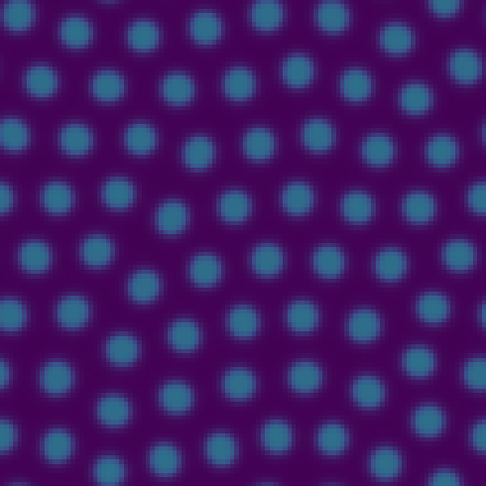 | 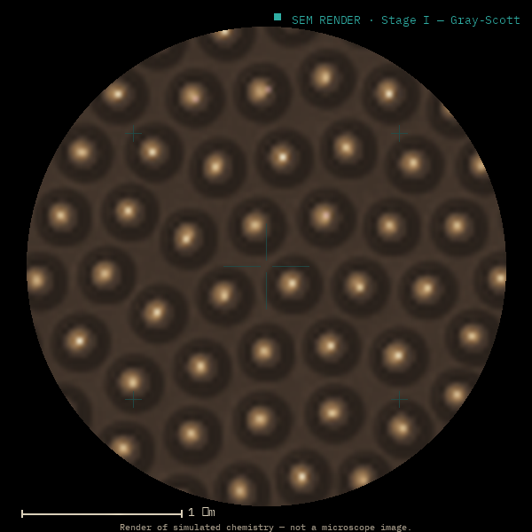 |

**A walk through the chemistry-to-life arc (SEM renders):**

| Stage II — vents | Stage VI — homochirality | Stage VII — RNA world |
|---|---|---|
| 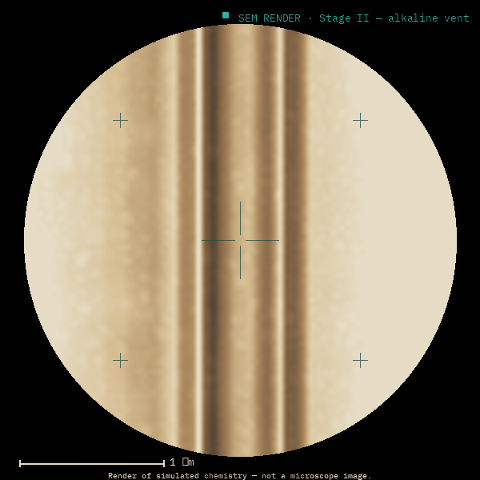 | 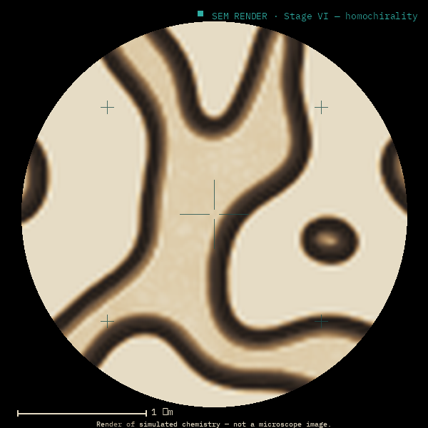 | 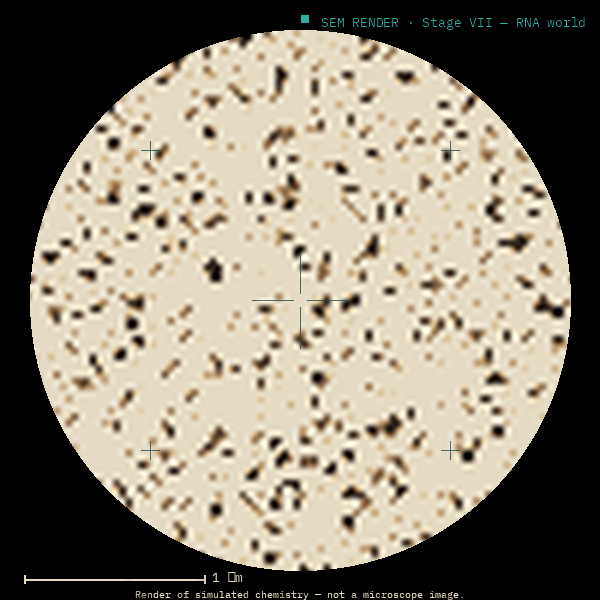 |

| Stage IX — coacervates | Stage X — vesicles | Stage XII — LUCA |
|---|---|---|
| 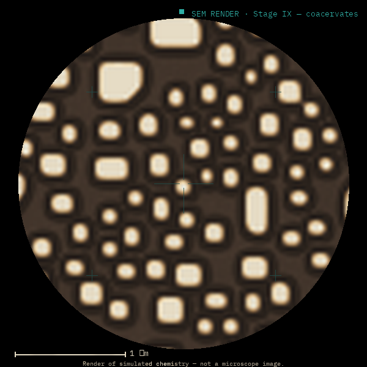 | 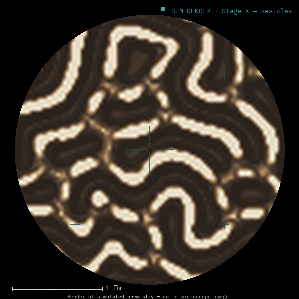 | 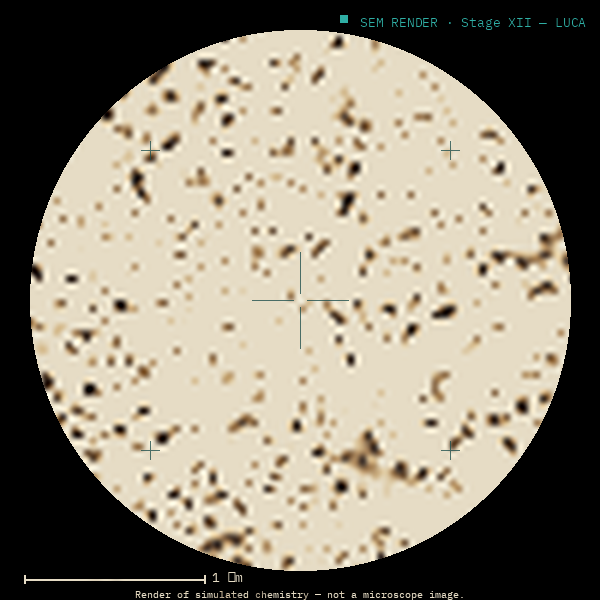 |

**Reference automata (discrete renderer):**

| Conway — Life | Wolfram — Rule 110 | Stage 0 — soup |
|---|---|---|
| 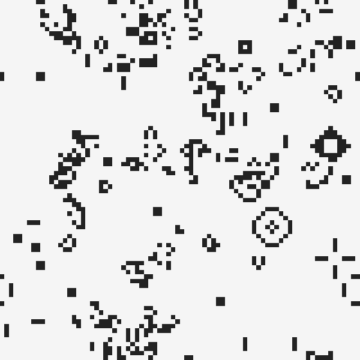 | 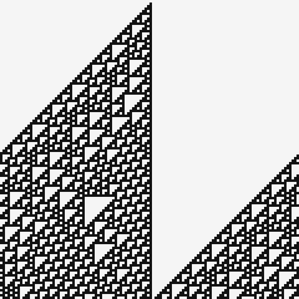 | 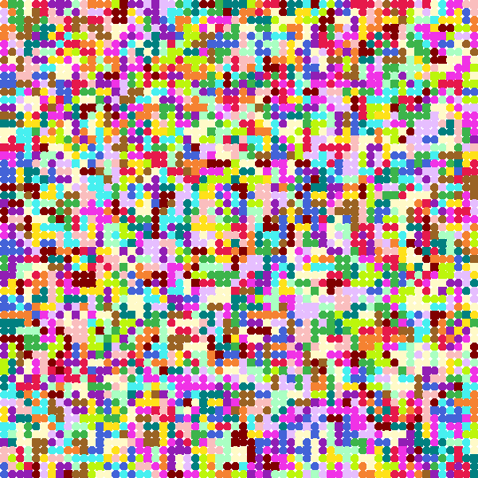 |

The SEM chrome is honest: each frame carries "Render of simulated chemistry — not a microscope image" — consistent with `docs/science.md`'s "SEM mode is a rendering choice, not new physics."

### Captured results data (proof the science behaves)

Final population stats from the harness — the dynamics produce scientifically sane outputs:

| Rule | Key readouts (after N steps) | Confirms |
|---|---|---|
| `abiogenesis-luca` | `luca_size=12`, `essential_target=12` | LUCA distillation locks to the essential count ✅ |
| `abiogenesis-coacervate` | `droplets=97`, `rich_pct=27` | Cahn-Hilliard nucleation + Ostwald coarsening ✅ |
| `abiogenesis-genetic-code` | `code_consensus=65`, `master_pct=45` | Consensus rises well above random baseline (≈1/n) ✅ |
| `abiogenesis-pipeline` | `stage=4`, `protocells=101`, `avg_fitness=0.916` | Pipeline auto-promotes & couples through to selection ✅ |
| `abiogenesis-pipeline-extended` | reaches `stage=7` by step 700 | Extended arc advances end-to-end ✅ |

---

## 4. Scientific honesty audit — the 5 "now-REAL" claims, adjudicated

The ROADMAP markets five things as upgraded from toy to "REAL." Verified against code:

1. **G2 Eigen-Schuster ODE (Stage XI)** — ✅ **Holds.** Genuine Euler integration; correct fixed-point/collapse behaviour.
2. **G3 Helfrich bending (Stage X)** — ⚠️ **Half-holds.** A biharmonic term runs, but it's a dimensionless regulariser, not a calibrated modulus. *Caveat overclaims* (REV-09).
3. **G4 Miyazawa-Jernigan (Stage VIII)** — ⚠️ **Half-holds.** The MJ table replaced the fixed target (real), but it doesn't produce "code coevolution"; the docstring's central mechanism is absent (REV-02).
4. **G5 pathway-graph LUCA (Stage XII)** — ⚠️ **Half-holds.** Pathway fitness is real; "core = network invariant" is loose; doc number stale (REV-10).
5. **Coupled pipeline (G1)** — ✅ **Holds in substance** (state genuinely flows), but the ROADMAP names a non-existent `inherit_from` adapter and self-contradicts (REV-15).

**Net:** 2 fully hold, 3 are real-but-overclaimed. The fix for all three is *prose, not physics* — soften the claims to match what the (already quite good) code does, or close the small implementation gap.

---

## 5. Per-area findings (full list → register)

- **A. Correctness & test integrity** — REV-01…07 (Tk-coupled red suite; tautology cluster; `life_sem.py`/`tutorial.py` gaps).
- **B. Scientific honesty** — REV-08…11 (science.md Stage 4 contradiction; Helfrich/LUCA overclaim; Stage XIII undocumented).
- **C. Documentation drift** — REV-12…17 (stale PRD; missing PRDs; triple test-count; `inherit_from`; "four gates").
- **D. Web client** — REV-18…23 (minerals stand-in; ungated web2/web3; web4/web6 naming; CDN dependency).
- **E. GUI/UX** — REV-24…28 (blocking modals; transport below fold; error-surface inconsistency; polish).
- **F. Code hygiene** — REV-29…32 (Stage XIII unregistered; dead `_v401_sprites`; render_cell≠render_rgb; division-site docstring).
- **G. CI/infra** — REV-33…36 (action-version consistency; coverage gate; pip-audit scope; mypy strictness + py3.13).

See [`ISSUE_REGISTER.md`](ISSUE_REGISTER.md) for evidence and fix direction on each.

---

## 6. Recommendation — proposed v4.2 "Honesty & hygiene closure" cycle

This review *is* the gap analysis for the next cycle. Priority order (now tracked as `REV-*` in ROADMAP §7):

1. **Make the suite honestly green everywhere** (REV-01): decouple config I/O from Tk so headless/CI-without-Tk is green; raise the coverage gate to match reality (REV-34).
2. **Close the 3 overclaims with prose** (REV-08/09/10/15) and **document Stage XIII** (REV-11) — highest brand-risk, lowest effort.
3. **Reconcile every count and dead link** (REV-12/13/14/16/17) — a single "doc-honesty" pass. *(Started in this PR.)*
4. **Web canonicalisation debt** (REV-18/19/20) — port `minerals.js` or label it; gate or retire web2/web3.
5. **UX kiosk-readiness** (REV-24/25) — transport above the fold; stop-before-export.

Everything else is minor hygiene that can ride along.

---
*Generated as the deliverable of the PM idea→UX-team pipeline. Issues are documented here and mirrored to the punchlist (`docs/ROADMAP.md` §7) and product PRDs.*
