# Web 10 · "Catalytic Silence — Mark X" — design & change callouts

This is the visual spec for **web10**: the Mark X UI with every change called out,
and the per-level hero art (one image per abiogenesis stage) annotated with its
composition. It's the companion to the live client (`docs/web10/`) and the plan.

**Status:** `[DONE]` shipped · `[BUILD]` to implement · `[OPT]` stretch · `✅` art generated (Gemini/Imagen).

---

## 1 · The Mark X UI — every change called out

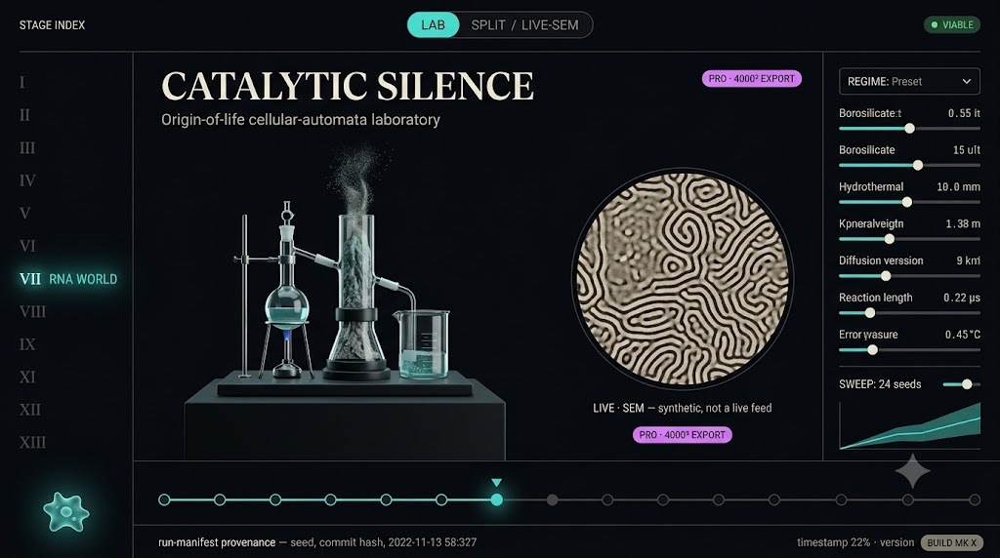

```
 ┌──────────────────────────────────────────────────────────────────────────────────┐
 │ ●  cellauto  ─ an origin-of-life instrument   ⟨MK X⟩①        PL.VII · LAB · cat.   │  HEADER
 ├────────────────────┬───────────────────────────────────────────┬───────────────────┤
 │  STAGE RAIL ③      │   ┌────────────────┐  ┌───────────────────┐│  PARAMETERS ⑥     │
 │ ┌────────────────┐ │   │                │  │   ◜ ● LIVE·SEM ◞  ││  REGIME:  spots ▾ │
 │ │ I   ░░hero░░   │ │   │  3D APPARATUS  │  │   ╭───────────╮   ││  F  ──●─────── .037│
 │ │ II  ░░hero░░ ◀ │ │   │  (per stage)   │  │   │ ▓ micro-  │   ││  k  ─────●──── .060│
 │ │ ...            │ │   │                │  │   │ ▓ graph   │   ││  Du ───●────── .16 │
 │ │ XIII ░░hero░░  │ │   │                │  │   ╰───────────╯   ││  ░ chart ▁▂▃▅▆    │
 │ └────────────────┘ │   └────────────────┘  │   ⟨PRO · 4000²⟩④  ││  [Step] [Reset]   │
 │ ③ card = its stage │      ◖ LAB · SPLIT · LIVE·SEM ◗           ││                   │
 ├────────────────────┴───────────────────────────────────────────┴───────────────────┤
 │  ◀  ●─○─○─○─○─○─◉─○─○─○─○─○─○  ▶  TIMELINE ⑤      seed 1 · 7c3a… · 2026-06 ⑥        │  FOOT (NEW)
 └──────────────────────────────────────────────────────────────────────────────────┘
   ② magenta accent on ⟨MK X⟩ · ⟨PRO⟩ · active node ◉        ⑦ amoeba guide ◍ (lower-left)
```

| # | Change | Where | Status |
|---|--------|-------|--------|
| ① | **"MK X" build tag** | header brand | `[DONE]` |
| ② | **Magenta accent** (`#d77bff`) on tag / pill / active states | shell-wide | `[DONE]` |
| ③ | **Hero-art stage rail** — each card backed by its `generated/web10/stageNN_*.png` (graceful fallback to the solid card when absent) | left rail | `[DONE]` |
| ④ | **Pro · 4000² export pill** → web9 Pro Studio | over the SEM plate | `[DONE]` |
| ⑤ | **13-node timeline scrubber** — ◀/▶ + a node per stage, `◉` = current, click → `loadStageById` | new footer | `[BUILD]` |
| ⑥ | **Provenance strip** — `seed · commit · timestamp` | footer, beside ⑤ | `[BUILD]` |
| ⑦ | **Amoeba guide** (port web8 `guide.js`/`blobgeom.js`) | lower-left | `[OPT]` |
| ⑧ | **Deeper Pro export** — pill POSTs the current stage/params to web9 `/api/render` inline | plate pill | `[OPT]` |

*(The embedded mockup above is the Gemini/Imagen concept render; the live client
matches its structure. The ① ④ shell changes ship in PR #78; ⑤ ⑥ are the next build.)*

---

## 2 · The per-level hero — composition template (Ⓐ–Ⓔ)

Every level's hero shares one composition; only the apparatus, micrograph, and tag
change. Each §3 block lists what fills Ⓐ–Ⓔ for that stage.

```
 ┌───────────────────────────────────────────────────────────┐
 │ Ⓔ obsidian field · teal+magenta · vitrine rim-light        │
 │            ╭─────────────╮          ╭─────────────╮         │
 │            │  Ⓐ 3D       │          │ Ⓑ ◜ SEM ◞   │         │
 │            │  APPARATUS  │          │  (circular  │         │
 │            │  on plinth  │          │  micrograph)│         │
 │            ╰─────────────╯          ╰─────────────╯         │
 │   CATALYTIC SILENCE · <APPARATUS> Ⓓ                        │
 │   System · Reagent · Process  (science caption)            │
 │                                       ⟨ Ⓒ [ROMAN] · NAME ⟩ │
 └───────────────────────────────────────────────────────────┘
```

- **Ⓐ Apparatus** — the stage's instrument on a dark plinth.
- **Ⓑ Circular SEM micrograph inset** — the stage's depth-shaded micrograph motif.
- **Ⓒ Stage tag** — `[ROMAN] · NAME`, corner.
- **Ⓓ Caption** — didone title + one-line science gloss.
- **Ⓔ Styling** — `#07090d` ground, teal `#3fe0d0`, sparing magenta `#d77bff`; sharp/flat, no blur.

---

## 3 · The 13 levels — image + callouts

### I · Miller–Urey  ✅
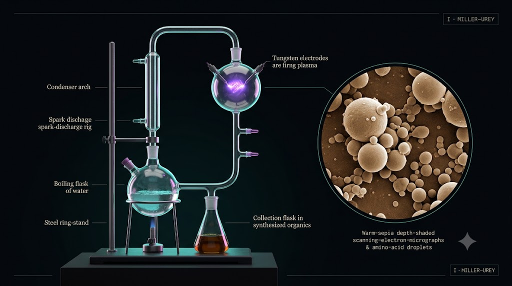
- **Ⓐ** spark-discharge glassware: boiling flask, upper spark chamber w/ electrodes, condenser arch, darkening collection flask · **Ⓑ** organic microspheres coalescing · **Ⓒ** `I · MILLER–UREY` · **Ⓔ** photoreal warm.

### II · Reaction–diffusion  ✅
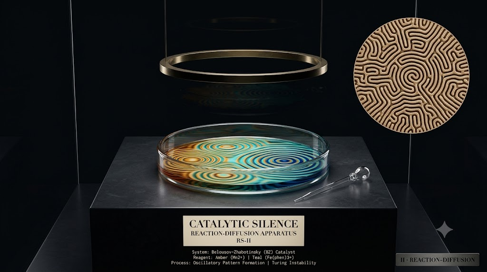
- **Ⓐ** shallow Petri dish under a brass ring light, concentric Belousov–Zhabotinsky waves · **Ⓑ** labyrinthine reaction-diffusion / Turing maze · **Ⓒ** `II · REACTION–DIFFUSION` · **Ⓔ** warm-sepia.

### III · Autocatalytic sets  ✅
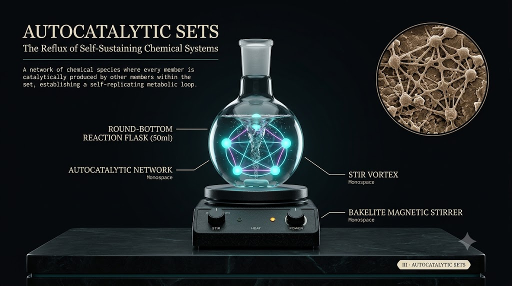
- **Ⓐ** round-bottom flask on a stir plate; ring of glowing catalyst nodes + cyan edges (reflexive closure) · **Ⓑ** networked catalytic nodes · **Ⓒ** `III · AUTOCATALYTIC SETS` · **Ⓔ** warm-sepia.

### IV · Vesicles  ✅
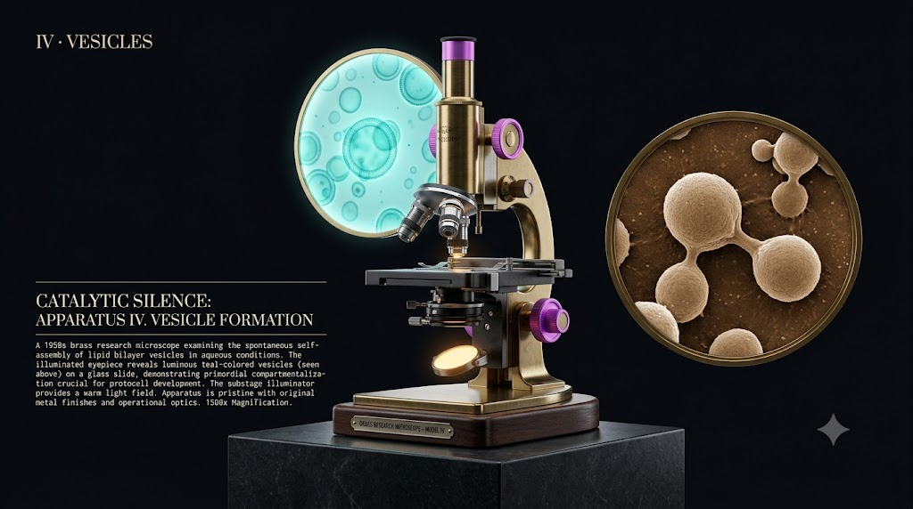
- **Ⓐ** vintage brass microscope; eyepiece disc of drifting teal bilayer vesicles · **Ⓑ** dividing vesicles · **Ⓒ** `IV · VESICLES` · **Ⓔ** warm-sepia.

### V · Hydrothermal vent  ✅
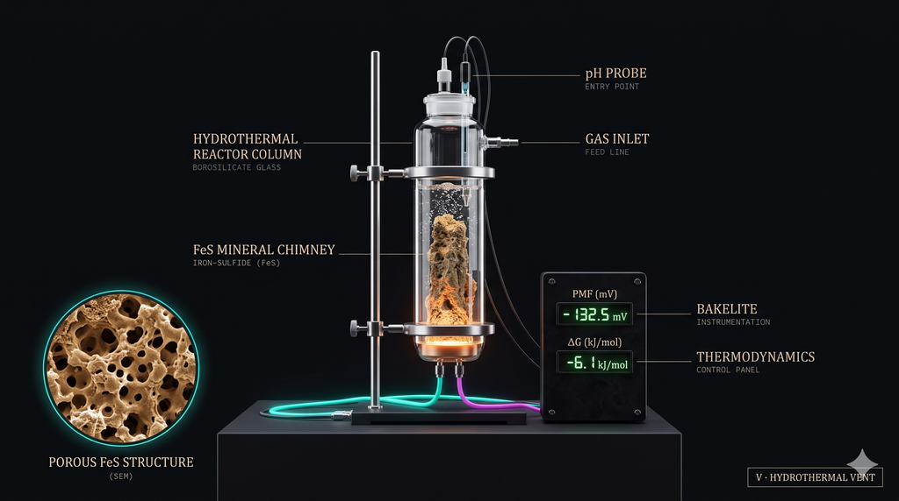
- **Ⓐ** sealed glass reactor column, glowing FeS mineral chimney, pH probe, bakelite mV/ΔG readout · **Ⓑ** porous mineral-chimney pores · **Ⓒ** `V · HYDROTHERMAL VENT` · **Ⓔ** warm-sepia.

### VI · Mineral catalysis  ✅
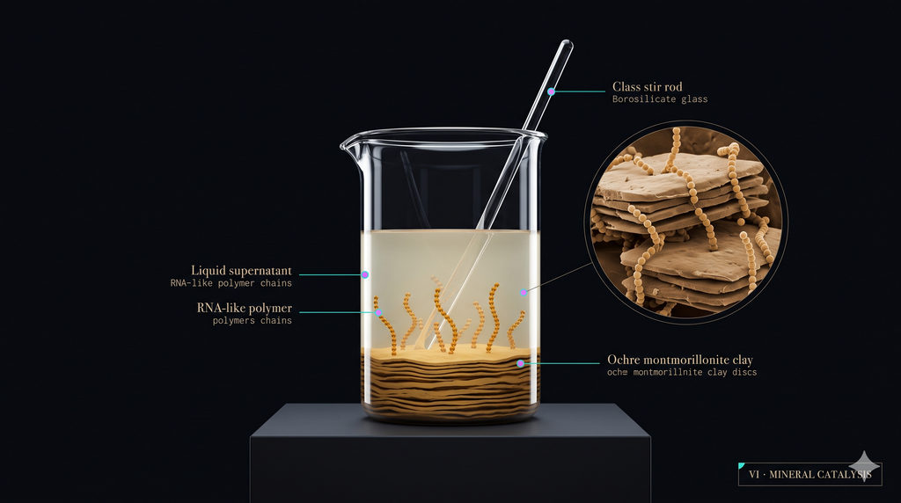
- **Ⓐ** beaker with a layered ochre montmorillonite clay bed, amber RNA-like chains growing up · **Ⓑ** clay platelets + polymer chains · **Ⓒ** `VI · MINERAL CATALYSIS` · **Ⓔ** warm-sepia.

### VII · Homochirality  ✅
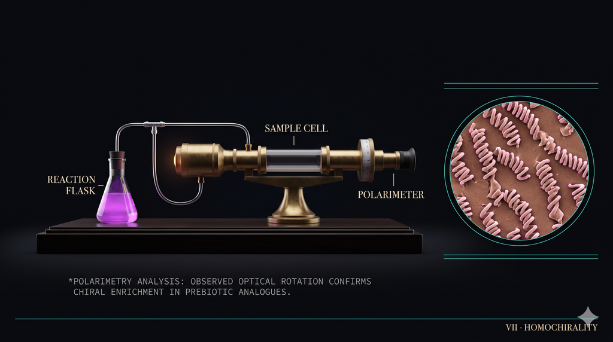
- **Ⓐ** tinting reaction flask + brass polarimeter, needle swung off-zero · **Ⓑ** chiral spiral microtextures · **Ⓒ** `VII · HOMOCHIRALITY` · **Ⓔ** warm-sepia + magenta cast.

### VIII · RNA world  ✅
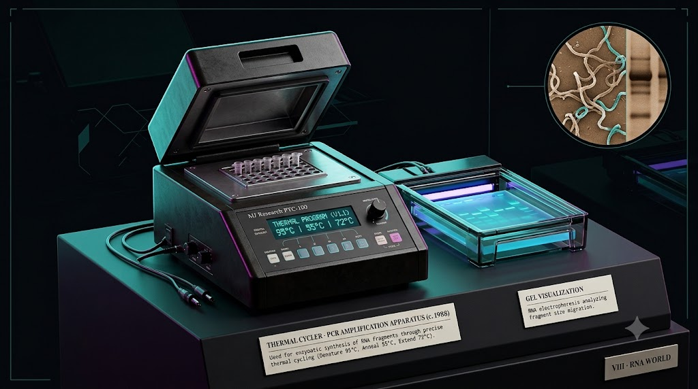
- **Ⓐ** PCR thermocycler, 8-tube strip, glowing thermal-program display, gel-doc teal bands · **Ⓑ** migrating RNA strands / bands · **Ⓒ** `VIII · RNA WORLD` · **Ⓔ** warm-sepia + teal.

### IX · Genetic code  ✅
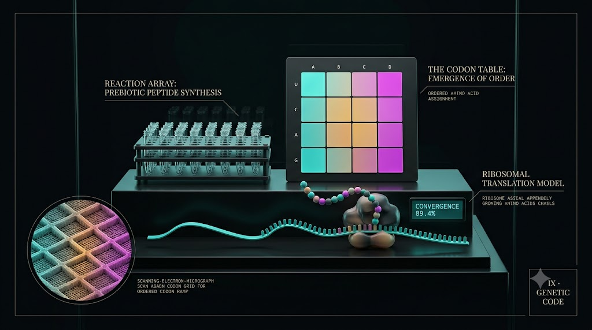
- **Ⓐ** 4×4 codon-table card locking into a teal→warm→magenta spectrum, ribosome on mRNA · **Ⓑ** ordered codon grid · **Ⓒ** `IX · GENETIC CODE` · **Ⓔ** teal–warm–magenta ramp.

### X · Coacervates  ✅
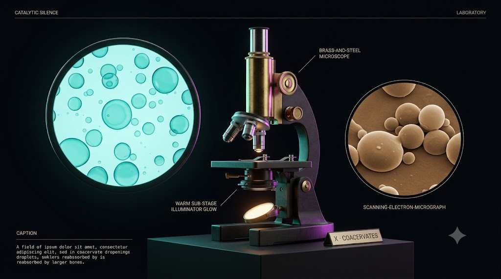
- **Ⓐ** brass microscope; eyepiece disc of teal coacervate droplets ripening · **Ⓑ** coalescing droplets · **Ⓒ** `X · COACERVATES` · **Ⓔ** warm-sepia.

### XI · Protocell selection  ✅
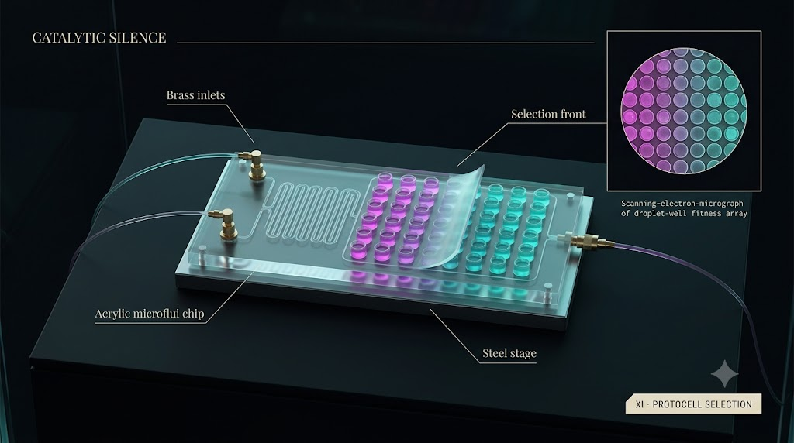
- **Ⓐ** acrylic microfluidic chip, serpentine channel, 5×8 well grid (magenta→teal fitness) · **Ⓑ** droplet-well fitness array · **Ⓒ** `XI · PROTOCELL SELECTION` · **Ⓔ** magenta→teal.

### XII · LUCA  ✅
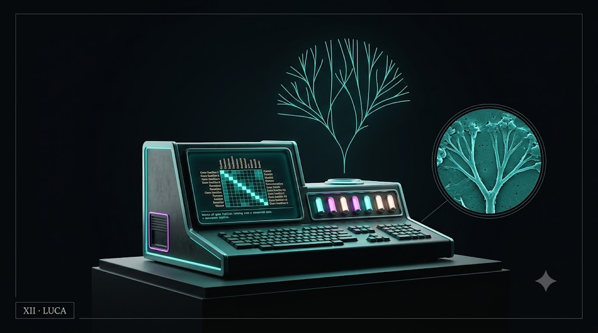
- **Ⓐ** vintage-futurist console, gene-family screen locking to a core, rotating tree-of-life hologram converging to a root · **Ⓑ** converging phylogenetic tree · **Ⓒ** `XII · LUCA` · **Ⓔ** teal emissive.

### XIII · Stromatolite  ✅
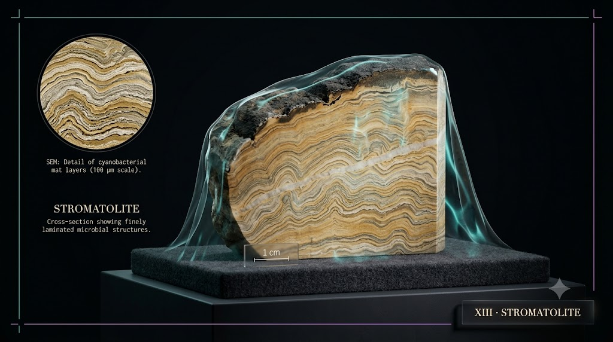
- **Ⓐ** sawn rock hand-specimen on felt, ochre/cream/grey laminations, scale bar, faint teal water caustics · **Ⓑ** layered microbial laminae · **Ⓒ** `XIII · STROMATOLITE` · **Ⓔ** ochre/cream/grey.

---

## 4 · Change log

| Change | Status | Notes |
|---|---|---|
| ① MK X build tag · ② magenta accent · ③ hero-art rail · ④ Pro 4000² pill | `[DONE]` | shipped in PR #78 |
| ⑤ timeline scrubber · ⑥ provenance strip | `[BUILD]` | next build |
| ⑦ amoeba guide · ⑧ inline Pro `/api/render` · #65 control parity | `[OPT]` | stretch |
| 13 per-level hero PNGs | **`13/13` ✅** | generated via Gemini/Imagen, committed under docs/generated/web10/ |

> Note: the Gemini extractor recovered; the set was generated one-at-a-time (the concurrent batch overloads the tab past its 120s cap — ~7/11 of a batch survive, the rest are re-run singly). Re-run any single stage with the same prompt to refine it.
